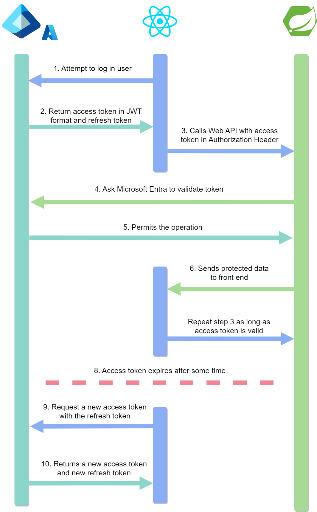

# Spring Packbase

    

        </a>
        
    

Base package to start a REST API app with Spring-boot.

## Where to start ?

### Copy the project using git

This documentation assumes that you know already how to use `git`.

First, make sure that you have `git` on your machine.

Open up your favorite terminal emulator and type in `git clone https://github.com/OrifInformatique/spring-packbase.git`.

### Make the project work on your machine

#### External dependencies

You will need 4 external dependencies:

- Java / openJDK 21
- Maven 3.9.9
- Spring-boot 3.3.3
- MariaDB 11.5.2

Make sure that your windows or WSL environnment variable contains the path to Java.

#### Application proprieties
The application is now almost ready!
The last thing that needs to be done is to link the database to your app.

To do that:
1. Copy the file `application.properties-dist` in the root of the project. Be careful to NOT modify this file itself.
2. Rename you copied file to `application.proprieties`.
3. Open the file in you IDE of choice and uncomment the `### Database connection ###` section.
4. Insert your database url and credentials.

This step is important because you do not want your **top secret** password to be public on github.

## What's next ?

Some additional documentation will be soon available in the `docs/` folder.

In the mean time, feel free to explore the code and create your own branch to
learn about Spring-boot !

The item module is here as an exemple of how to create your own.

Good luck !

## Command cheat-sheet

This app is mainly accessed through the terminal, therefore, a lot of commands
have to be memorized.

Here is a list of the most common commands you'll likely use !

**Run the app**

`mvn spring-boot:run`

**Downloads all the dependencies without building or compiling the app**

`mvn dependency:resolve`

**Same as `mvn dependency:resolve` but displays the dependency tree**

`mvn dependency:tree`

**Removes the previously built artefacts and .JAR file**

`mvn clean`

**Build the project into a .JAR file**

`mvn package`

**Check if the project's structure is valid**

`mvn validate`

## Microsoft Entra / Azure AD oAuth2 grant flow

### Simplified sequence diagram

    

## Sources

[Microsoft oAuth2 grant flow](https://learn.microsoft.com/en-us/entra/identity-platform/v2-oauth2-auth-code-flow)

---
