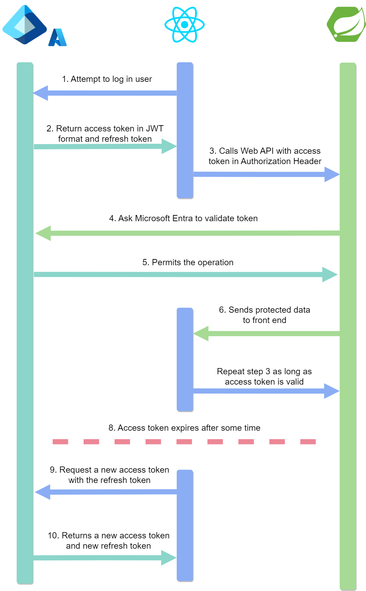

# Spring template

    

        </a>
        
    

Template to start developing a new REST API application with Spring Boot.

# Table of Contents
- [Spring template](#spring-template)
- [Table of Contents](#table-of-contents)
  - [Getting Started](#getting-started)
    - [Prerequisites](#prerequisites)
      - [Optionnal](#optionnal)
    - [`Application properties` and `.env`](#application-properties-and-env)
      - [`application.properties`](#applicationproperties)
      - [`.env`](#env)
  - [What's next ?](#whats-next)
  - [Command cheat-sheet](#command-cheat-sheet)
  - [Docker](#docker)
    - [Init project using docker](#init-project-using-docker)
    - [Do action from within Docker (CLI)](#do-action-from-within-docker-cli)
    - [Docker cheat-sheet](#docker-cheat-sheet)
  - [Microsoft Entra / Azure AD oAuth2 grant flow](#microsoft-entra-azure-ad-oauth2-grant-flow)
    - [Simplified sequence diagram](#simplified-sequence-diagram)
  - [Sources](#sources)

## Getting Started
These instructions will get you a copy of the project up and running on your local machine for development and testing purposes.

### Prerequisites
The Spring Boot version currently used in this project is 3.3.5.

The project's environment must contain these tools. Make sure that your Windows or WSL environnment variables contain the path to Java.

- [Java / openJDK 21](https://adoptium.net/fr/temurin/releases/)
- [Maven 3.9](https://maven.apache.org/docs/history.html)
- [MariaDB 10.4](https://mariadb.org/mariadb/all-releases/). A MySQL equivalent can also be installed with [Laragon](https://laragon.org/download/)

#### Optionnal

It is recommanded to develop the app using docker.
This is not a hard requirement but it's highly encouraged.
For more info, head to the [Docker section](#docker) of this documentation.

- [Docker](https://www.docker.com/products/docker-desktop/)
- [Docker-compose](https://docs.docker.com/compose/)
- On linux or WSL (Included in Docker desktop): [Docker-buildx](https://github.com/docker/buildx)

### `Application properties` and `.env`

#### `application.properties`
Link your database to your app :

1. DON'T modify the `application.properties-dist` file but make a copy of it in the root of the project.
2. Rename your copied file to `application.properties`.
3. Open the file in you IDE of choice and uncomment the `### Database connection ###` section.
4. Insert the prod database url and credentials.

The `application.properties` file is git ignored. This is important because you do not want your **top secret** password to be public on github.

#### `.env`
The `.env` is where you declare which environment you're working in.
It's used by your application.properties.
Docker uses it to know what container to build or start and how.

There's 3 valid environments:
- dev (Working environment)
- test
- prod (Only meant to be deployed)

## What's next ?

Some additional documentation will be soon available in the `docs/` folder.

In the mean time, feel free to explore the code and create your own experiment branch to
learn about Spring Boot !

The item module is here as an exemple of how to create your own modules.

Good luck !

## Command cheat-sheet

This app is mainly accessed through the terminal, therefore, a lot of commands
have to be memorized.

Here is a list of the most common commands you'll likely use !

**Run the app**

`mvn spring-boot:run`

**Downloads all the dependencies without building or compiling the app**

`mvn dependency:resolve`

**Same as `mvn dependency:resolve` but displays the dependency tree**

`mvn dependency:tree`

**Removes the previously built artefacts and .JAR file**

`mvn clean`

**Build the project into a .JAR file**

`mvn package`

**Check if the project's structure is valid**

`mvn validate`

## Docker

In this app, we use docker-compose, a Docker wrapper.
It allows you to make sure you don't have unexcpected issues, notably with lambok
and the database while you work.

A dedicated cheat-sheet is available in the [docker cheat-sheet](#docker-cheat-sheet)
sub-section.

### Init project using docker
First, you need to build the containers.

To build containers:

1. Make sure `ENVIRONMENT=dev|test|prod` is set in `.env` !
2. In the `backend/` directory, use the command `docker compose build`

Now that they have been built, you can start the containers with `docker compose up`

Note that each time you change the `ENVIRONMENT` variable, you need to use
the command `docker compose build`.

### Do action from within Docker (CLI)

To manipulate your application from within a container, you simply need to
enter it using the command `docker exec -it <container name> sh`.

You're now using the container's terminal.

### Docker cheat-sheet

**Build containers**
`docker compose build`

**Start containers**
`docker compose up`

*run in background*
`docker compose up -d`

**Enter a container with shell**
`docker exec -it <container name> sh`

## Microsoft Entra / Azure AD oAuth2 grant flow

### Simplified sequence diagram

    

## Sources

[Microsoft oAuth2 grant flow](https://learn.microsoft.com/en-us/entra/identity-platform/v2-oauth2-auth-code-flow)

---
