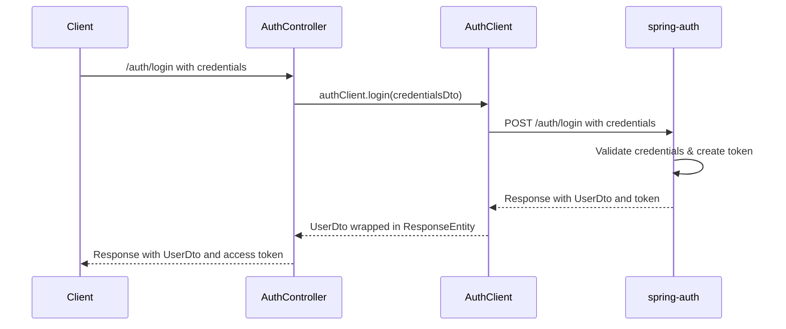
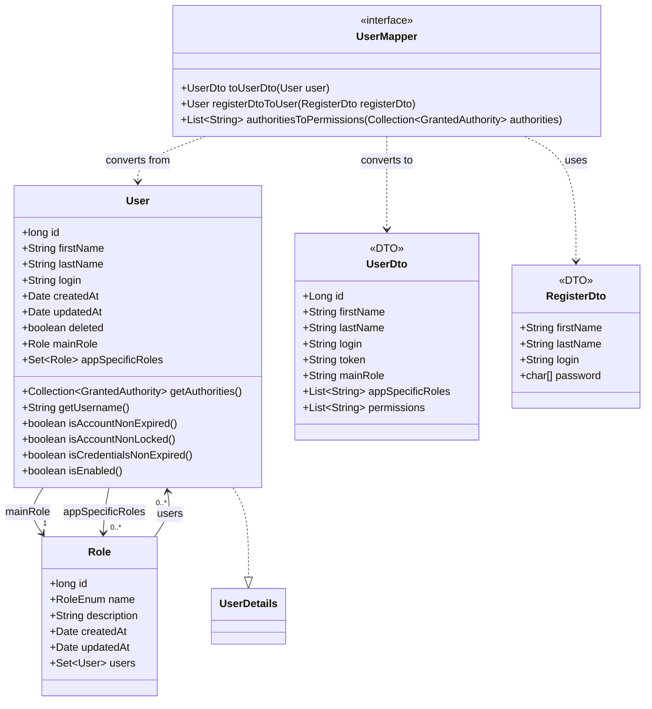
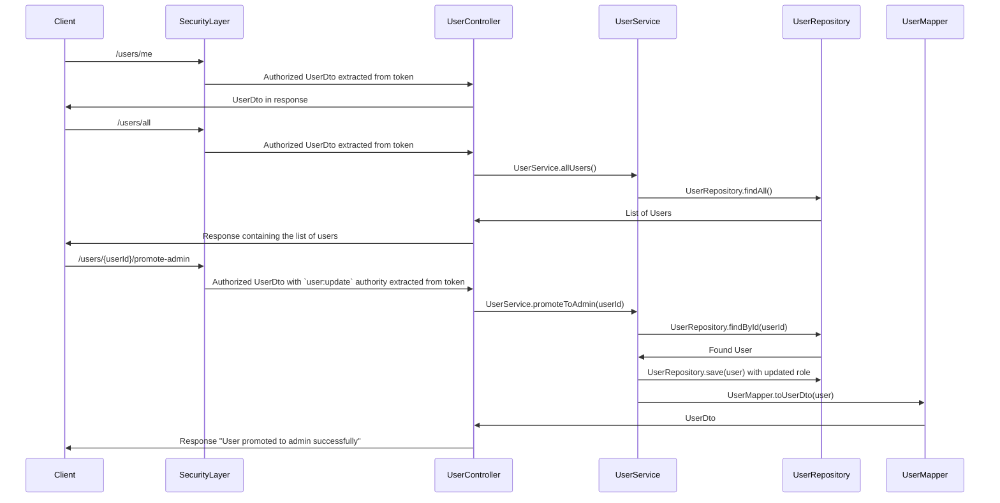
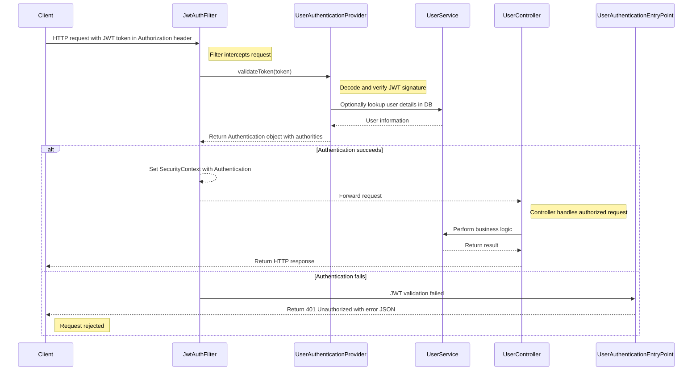

# Application Documentation

## Table of Contents

- [Application Documentation](#application-documentation)
  - [Table of Contents](#table-of-contents)
  - [Overview](#overview)
  - [1. Backend](#1-backend)
    - [1.1 General Information](#11-general-information)
    - [1.2 Root Files](#12-root-files)
    - [1.3 Root Folders](#13-root-folders)
    - [1.4 Source Structure (`src`)](#14-source-structure-src)
      - [1.4.1 `main`](#141-main)
      - [1.4.2 `test`](#142-test)
    - [1.5 Main Java Modules (`main/java`)](#15-main-java-modules-mainjava)
    - [1.6 Auth Module (`main/java/auth`)](#16-auth-module-mainjavaauth)
    - [1.7 User Module (`main/java/user`)](#17-user-module-mainjavauser)
    - [1.8 Security Module (`main/java/security`)](#18-security-module-mainjavasecurity)
    - [1.9 Error and Exception Managment (`main/java/app`)](#19-error-and-exception-managment-mainjavaapp)
    - [1.10 Item Module (`main/java/item`)](#110-item-module-mainjavaitem)
    - [1.11 Test Module (`main/java/test`)](#111-test-module-mainjavatest)
  - [Related Documentation](#related-documentation)

---

## Overview

This document describes the **structure, components, and processes** of the backend application, including configuration files, folder organization, and module responsibilities.

This backend powers a **multi-user test system**, providing:

- Secure authentication and authorization (delegated to spring-auth)
- User and role management
- Stock and inventory tracking

  
_Illustrates interactions between the frontend and backend modules, as well as the `spring-auth` app._

---

## 1. Backend

### 1.1 General Information

**Tools & Dependencies:**

- Java / OpenJDK 21
- Spring Boot 3.5.8
- Maven 3.9
- MariaDB 11.4
- Docker Desktop

> **Note:** Detailed setup and run instructions are provided in the project’s main [`README.md`](../README.md).

---

### 1.2 Root Files

| File                     | Description                                                      |
| ------------------------ | ---------------------------------------------------------------- |
| `pom.xml`                | Defines project dependencies, plugins, and build configurations. |
| `init.sql`               | SQL script to create and initialize the database schema.         |
| `Dockerfile`             | Defines Docker image build stages and application setup.         |
| `compose.yml`            | Configures Docker environment and additional services.           |
| `application.properties` | Global configuration properties for Spring Boot.                 |
| `.env`                   | Environment variables for local development and deployment.      |

---

### 1.3 Root Folders

| Folder   | Description                                                       |
| -------- | ----------------------------------------------------------------- |
| `src`    | Contains the application’s source code and resources.             |
| `target` | Compiled classes and build artifacts.                             |
| `docs`   | Auto-generated REST API documentation (HTML format).              |
| `doc`    | Manually created documentation (designs, requirements, diagrams). |

---

### 1.4 Source Structure (`src`)

#### 1.4.1 `main`

Contains the core functionality of the application.

- **`java`** – Source code (controllers, services, entities, configurations, etc.)
- **`resources`** – Configuration files, static resources, and templates

#### 1.4.2 `test`

Contains test classes for unit and integration tests.

- **`java`** – Test classes corresponding to the application’s source code
- **`resources`** – Test-specific configuration or data

> _Tests live under `src/test/java/ch/sectioninformatique/template` (unit/integration).
> REST Docs snippets are generated during test execution._

---

### 1.5 Main Java Modules (`main/java`)

| Module                    | Responsibility                                                                                                                                                                   |
| ------------------------- | -------------------------------------------------------------------------------------------------------------------------------------------------------------------------------- |
| `app`                     | Global error and exception handling used throughout the application.                                                                                                             |
| `auth`                    | Handles authorization processes such as login and registration; controllers delegate to the [`spring-auth`](https://github.com/OrifInformatique/spring-auth) service via `AuthClient`. |
| `item`                    | Manages stock and inventory functionalities (CRUD with security guards).                                                                                                       |
| `security`                | Security-related classes: JWT filters, password encoding, and authentication management.                                                                                         |
| `user`                    | Manages user profiles, roles, and permissions.                                                                                                                                  |
| `test`                    | Test-related endpoints and utilities for development and testing.                                                                                                                |
| `AuthApplication.java`    | Main Spring Boot entry point containing the `main()` method. Run the project from this class.                                                                                   |

---

### 1.6 Auth Module (`main/java/auth`)

_Sequence Diagram showing the actual authentication flow with spring-auth delegation._

_Sequence Diagram showing an example of the refresh token workflow._

| File                     | Description                                                                                                     |
| ------------------------ | --------------------------------------------------------------------------------------------------------------- |
| `AuthClient.java`        | HTTP client for communicating with the `spring-auth` service.                                                    |
| `AuthController.java`    | Authentication endpoints delegating to `spring-auth` via `AuthClient`.                                           |
| `CredentialsDto.java`    | Data Transfer Object (DTO) for login credentials.                                                               |
| `MessageResponseDto.java` | DTO for message-based API responses.                                                                             |
| `PasswordUpdateDto.java` | DTO for password update operations.                                                                              |
| `RefreshRequestDto.java` | DTO for refresh token requests.                                                                                  |
| `RegisterDto.java`       | DTO for registration functionalities.                                                                           |
| `TokenResponseDto.java`  | DTO for token-based API responses.                                                                              |
| `AuthExceptions.java`    | Container class for auth-specific custom exceptions.                                                            |

> **Reference:** For full authentication implementation, see the [`spring-auth`](https://github.com/OrifInformatique/spring-auth) repository.

---

### 1.7 User Module (`main/java/user`)

_Class Diagram showing the `User`, `Role`, `UserDto`, and `SignUpDto` structure._

_Sequence Diagram showing an example of the user management flow._

| File                           | Description                                                                        |
| ------------------------------ | ---------------------------------------------------------------------------------- |
| `User.java`                    | Entity class representing a user in the system.                                    |
| `UserController.java`          | Contains REST endpoints for user management (CRUD, profile, etc.).                 |
| `UserDto.java`                 | DTO for communication between backend and frontend.                                |
| `UserMapper.java`              | Handles conversion between `User` entities and `UserDto` objects.                  |
| `UserRepository.java`          | Interface for database operations related to users.                                |
| `UserRepositoryImpl.java`       | Custom implementation of user repository operations.                               |
| `UserRepositoryPermanentDelete.java` | Interface for permanent deletion of users.                                 |
| `UserSeeder.java`              | Seeds the database with test users for development.                                |
| `UserService.java`             | Business logic for user functionalities (creation, update, role assignment, etc.). |
| `UserExceptions.java`          | Container class for user-specific custom exceptions.                              |

---

### 1.8 Security Module (`main/java/security`)

_Sequence Diagram showing JWT authentication and request handling flow._

| File                                | Description                                                        |
| ----------------------------------- | ------------------------------------------------------------------ |
| `JwtAuthFilter.java`                | Authentication filter that processes tokens for incoming requests. |
| `PermissionEnum.java`               | Enumeration defining available permissions.                        |
| `Role.java`                         | Role entity class representing a user role.                        |
| `RoleEnum.java`                     | Enumeration defining roles and their permissions.                  |
| `RoleRepository.java`               | Interface for database operations related to roles.                |
| `RoleSeeder.java`                   | Seeds the database with predefined roles.                          |
| `SecurityConfig.java`               | Security configuration defining the filter chain and access rules. |
| `SecurityExceptions.java`           | Container class for security-specific custom exceptions.           |
| `UserAuthenticationEntryPoint.java` | Handles unauthenticated access by returning a 401 response.        |
| `UserAuthenticationProvider.java`   | Authentication provider for validating user credentials.           |
| `WebClientConfig.java`              | Configuration for HTTP client interactions.                        |
| `WebConfig.java`                    | Web configuration for general web-related settings.                |

---

### 1.9 Error and Exception Managment (`main/java/app`)

| File                                   | Description                                                |
| -------------------------------------- | ---------------------------------------------------------- |
| `errors/ErrorDto.java`                 | Record serving as Data Transfer Object for errors.         |
| `exceptions/AppException.java`         | Custom exception class for application-specific errors.    |
| `exceptions/GlobalExceptionHandler.java` | Global exception handler for REST API endpoints.           |

---

### 1.10 Item Module (`main/java/item`)

| File                        | Description                                                                |
| --------------------------- | -------------------------------------------------------------------------- |
| `Item.java`                 | Entity class representing a stock item.                                    |
| `ItemBuilder.java`          | Builder pattern implementation for creating Item objects.                  |
| `ItemController.java`       | REST endpoints for item CRUD operations guarded by Spring Security.        |
| `ItemRepository.java`       | Interface for database operations related to items.                        |
| `ItemSeeder.java`           | Seeds the database with test items for development.                        |
| `ItemService.java`          | Business logic for item functionalities.                                   |
| `ItemExceptionHandler.java` | Exception handler specific to item-related operations.                     |
| `ItemNotFoundException.java` | Custom exception thrown when an item is not found.                         |
| `UnauthorizedItemException.java` | Custom exception for unauthorized item access attempts.                |

---

### 1.11 Test Module (`main/java/test`)

| File                  | Description                                                |
| --------------------- | ---------------------------------------------------------- |
| `TestController.java` | Endpoints and utilities for development and testing purposes. |

---

## Related Documentation

- [Project README](../README.md)
- [API Documentation (`docs/index.html`)](../docs/index.html)
- [Frontend Repository](../frontend/README.md)

---

**Author:** Ken D. Cacciabue
**Last Updated:** 23.01.2026
