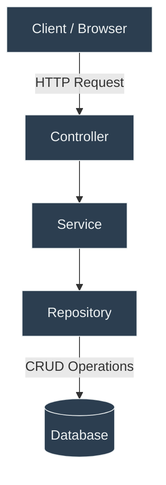
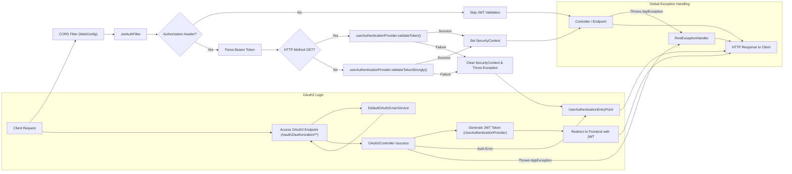

# Application Documentation

## Table of Contents
- [Overview](#overview)
- [1. Backend](#1-backend)
  - [1.1 General Information](#11-general-information)
  - [1.2 Root Files](#12-root-files)
  - [1.3 Root Folders](#13-root-folders)
  - [1.4 Source Structure (`src`)](#14-source-structure-src)
    - [1.4.1 `main`](#141-main)
    - [1.4.2 `test`](#142-test)
  - [1.5 Main Java Modules (`main/java`)](#15-main-java-modules-mainjava)
  - [1.6 Auth Module (`main/java/auth`)](#16-auth-module-mainjavaauth)
  - [1.7 Users Module (`main/java/users`)](#17-users-module-mainjavausers)
  - [1.8 Security Module (`main/java/security`)](#18-security-module-mainjavasecurity)
  - [1.9 Testing (Planned)](#19-testing-planned)
- [Related Documentation](#related-documentation)

---

## Overview

This document describes the **structure, components, and processes** of the backend application, including configuration files, folder organization, and module responsibilities.  

This backend powers a **multi-user test system**, providing:
- Secure authentication and authorization (delegated to spring-auth)
- User and role management  
- (Future) Stock and inventory tracking  

  
*Illustrates interactions between the frontend and backend modules, as well as the `spring-auth` app.*

---

## 1. Backend

### 1.1 General Information

**Tools & Dependencies:**
- Java / OpenJDK 21  
- Spring Boot 3.3.5  
- Maven 3.9  
- MariaDB 11.4  
- Docker Desktop  

> **Note:** Detailed setup and run instructions are provided in the project’s main [`README.md`](../README.md).

---

### 1.2 Root Files

| File | Description |
|------|-------------|
| `pom.xml` | Defines project dependencies, plugins, and build configurations. |
| `init.sql` | SQL script to create and initialize the database schema. |
| `Dockerfile` | Defines Docker image build stages and application setup. |
| `compose.yml` | Configures Docker environment and additional services. |
| `application.properties` | Global configuration properties for Spring Boot. |
| `.env` | Environment variables for local development and deployment. |

---

### 1.3 Root Folders

| Folder | Description |
|--------|-------------|
| `src` | Contains the application’s source code and resources. |
| `target` | Compiled classes and build artifacts. |
| `docs` | Auto-generated REST API documentation (HTML format). |
| `doc` | Manually created documentation (designs, requirements, diagrams). |

---

### 1.4 Source Structure (`src`)

#### 1.4.1 `main`
Contains the core functionality of the application.  

- **`java`** – Source code (controllers, services, entities, configurations, etc.)  
- **`resources`** – Configuration files, static resources, and templates  

#### 1.4.2 `test`
Contains test classes for unit and integration tests.  

- **`java`** – Test classes corresponding to the application’s source code  
- **`resources`** – Test-specific configuration or data  

> *Testing frameworks, execution instructions, and coverage details will be added once the Java modules are finalized.*

---

### 1.5 Main Java Modules (`main/java`)

| Module | Responsibility |
|--------|----------------|
| `app` | Global error and exception handling used throughout the application. |
| `auth` | Handles authorization processes such as login and registration. (Some functionalities moved to the [`spring-auth`](https://github.com/OrifInformatique/spring-auth) repository.) |
| `item` | Manages stock and inventory functionalities (not implemented yet). |
| `security` | Security-related classes: JWT filters, password encoding, and authentication management. |
| `users` | Manages user profiles, roles, and permissions. |
| `TemplateApplication.java` | Main Spring Boot entry point containing the `main()` method. Run the project from this class. |

---

### 1.6 Auth Module (`main/java/auth`)

| File | Description |
|------|-------------|
| `AuthController.java` | Authentication endpoints (moved to `spring-auth` in the newest branches). |
| `CredentialsDto.java` | Data Transfer Object (DTO) for login credentials. |
| `OAuth2Controller.java` | Handles OAuth2 and Azure login operations (success scenario only; now in `spring-auth` in the newest branches). |
| `PasswordConfig.java` | Manages password encryption (moved to `spring-auth` in the newest branches). |
| `SignUpDto.java` | DTO for registration functionalities. |

> **Reference:** For full authentication implementation, see the [`spring-auth`](https://github.com/OrifInformatique/spring-auth) repository.

---

### 1.7 Users Module (`main/java/users`)

| File | Description |
|------|-------------|
| `User.java` | Entity class representing a user in the system. |
| `UserController.java` | Contains REST endpoints for user management (CRUD, profile, etc.). | 
| `UserDto.java` | DTO for communication between backend and frontend. |
| `UserMapper.java` | Handles conversion between `User` entities and `UserDto` objects. |
| `UserRepository.java` | Interface for database operations related to users. |
| `UserSeeder.java` | Seeds the database with test users for development. |
| `UserService.java` | Business logic for user functionalities (creation, update, role assignment, etc.). |

---

### 1.8 Security Module (`main/java/security`)

| File | Description |
|------|-------------|
| `JwtAuthFilter.java` | Authentication filter that processes tokens for incoming requests. |
| `PermissionEnum.java` | Enumeration defining available permissions. |
| `Role.java` | Role entity class representing a user role. |
| `RoleEnum.java` | Enumeration defining roles and their permissions. |
| `RoleRepository.java` | Interface for database operations related to roles. |
| `RoleSeeder.java` | Seeds the database with predefined roles. |
| `SecurityConfig.java` | Security configuration defining the filter chain and access rules. |
| `UserAuthenticationEntryPoint.java` | Handles unauthenticated access by returning a 401 response. |
| `UserAuthenticationProvider.java` | Authentication provider for validating user credentials. |
| `WebConfig.java` | Web configuration for general web-related settings. |

> **Suggested addition:** A simple diagram showing the authentication flow (Request → JWT Filter → Provider → SecurityContext → Controller) can improve understanding.

---

## Related Documentation

- [Project README](../README.md)  
- [API Documentation (`docs/index.html`)](../docs/index.html)  
- [Frontend Repository](../frontend/README.md)  