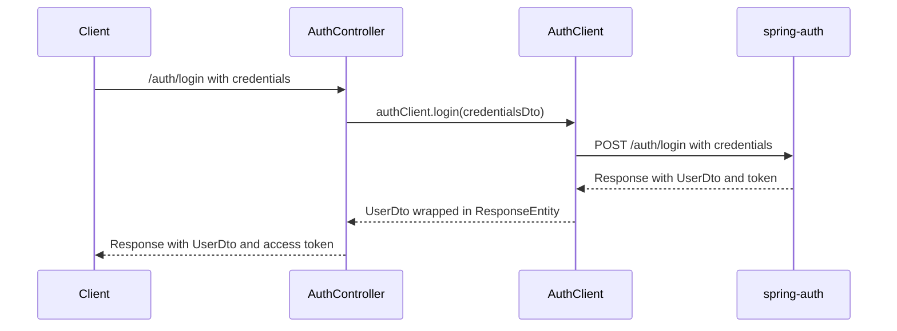
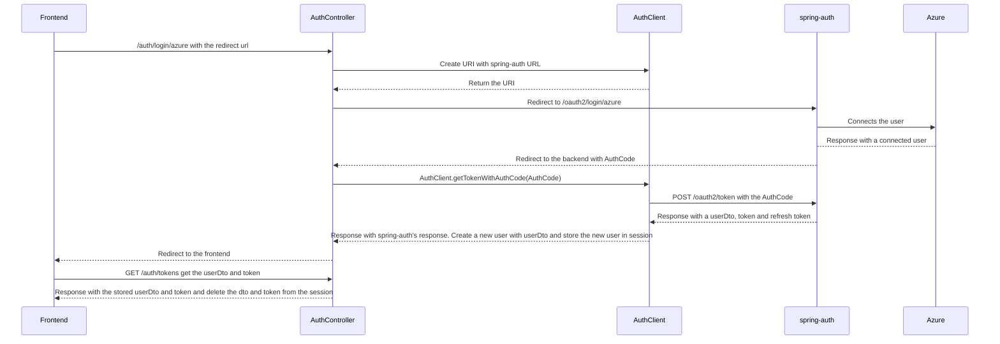
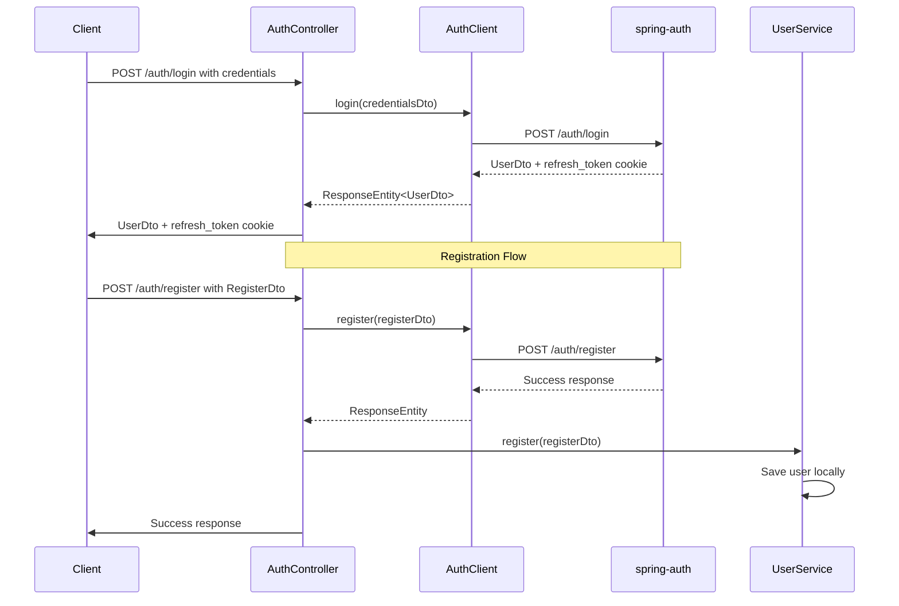
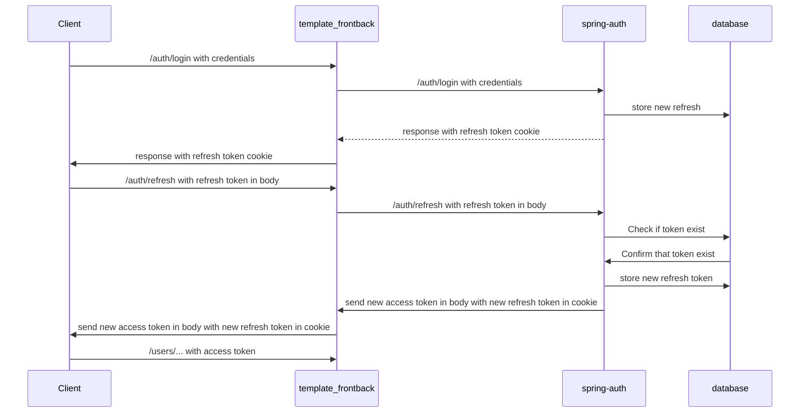
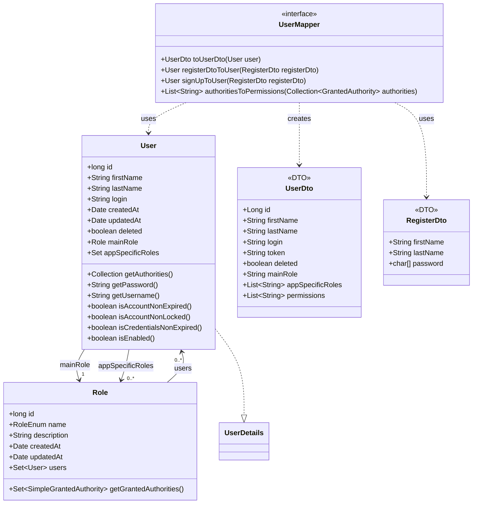
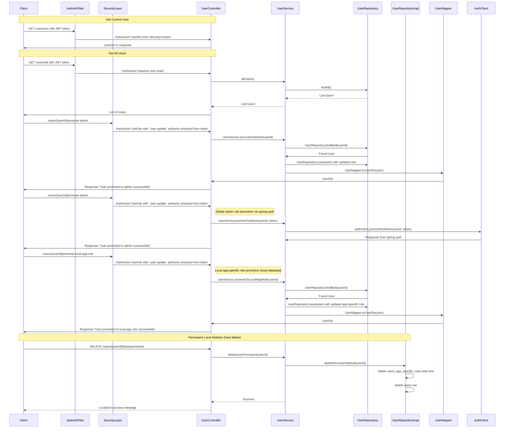
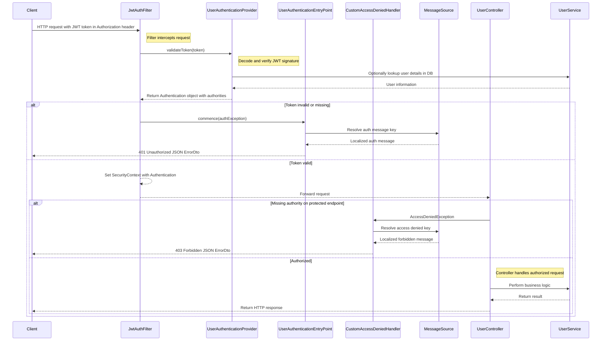
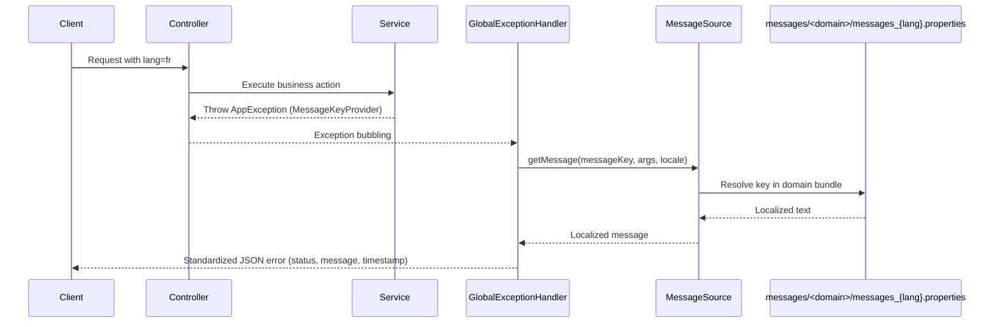

# Application Documentation

## Table of Contents

- [Application Documentation](#application-documentation)
  - [Table of Contents](#table-of-contents)
  - [Overview](#overview)
  - [1. Backend](#1-backend)
    - [1.1 General Information](#11-general-information)
    - [1.2 Root Files](#12-root-files)
    - [1.3 Root Folders](#13-root-folders)
    - [1.4 Source Structure (`src`)](#14-source-structure-src)
      - [1.4.1 `main`](#141-main)
      - [1.4.2 `test`](#142-test)
    - [1.5 Main Java Modules (`main/java`)](#15-main-java-modules-mainjava)
    - [1.6 Auth Module (`main/java/auth`)](#16-auth-module-mainjavaauth)
    - [1.7 User Module (`main/java/user`)](#17-user-module-mainjavauser)
    - [1.8 Security Module (`main/java/security`)](#18-security-module-mainjavasecurity)
    - [1.9 Error and Exception Management (`main/java/app`)](#19-error-and-exception-management-mainjavaapp)
    - [1.10 Item Module (`main/java/item`)](#110-item-module-mainjavaitem)
    - [1.11 Test Module (`main/java/test`)](#111-test-module-mainjavatest)
    - [1.12 Localization and Messages (`main/java/config` + `resources/messages`)](#112-localization-and-messages-mainjavaconfig--resourcesmessages)
  - [2. Today's Branch Updates (2026-03-10)](#2-todays-branch-updates-2026-03-10)
  - [Related Documentation](#related-documentation)

---

## Overview

This document describes the **structure, components, and processes** of the backend application, including configuration files, folder organization, and module responsibilities.

This backend powers a **multi-user test system**, providing:

- Secure authentication and authorization (delegated to spring-auth)
- User and role management
- Stock and inventory tracking

  
_Illustrates interactions between the frontend and backend modules, as well as the `spring-auth` app._

---

## 1. Backend

### 1.1 General Information

**Tools & Dependencies:**

- Java / OpenJDK 21
- Spring Boot 3.5.8
- Maven 3.9
- MariaDB 11.4
- Docker Desktop

> **Note:** Detailed setup and run instructions are provided in the project’s main [`README.md`](../README.md).

---

### 1.2 Root Files
| File                     | Description                                                      |
| ------------------------ | ---------------------------------------------------------------- |
| `pom.xml`                | Defines project dependencies, plugins, and build configurations. |
| `init.sql`               | SQL script to create and initialize the database schema.         |
| `Dockerfile`             | Defines Docker image build stages and application setup.         |
| `compose.yml`            | Configures Docker environment and additional services.           |
| `application.properties` | Global configuration properties for Spring Boot.                 |
| `.env`                   | Environment variables for local development and deployment.      |

---

### 1.3 Root Folders

| Folder   | Description                                                       |
| -------- | ----------------------------------------------------------------- |
| `src`    | Contains the application’s source code and resources.             |
| `target` | Compiled classes and build artifacts.                             |
| `docs`   | Auto-generated REST API documentation (HTML format).              |
| `doc`    | Manually created documentation (designs, requirements, diagrams). |

---

### 1.4 Source Structure (`src`)

#### 1.4.1 `main`

Contains the core functionality of the application.

- **`java`** – Source code (controllers, services, entities, configurations, etc.)
- **`resources`** – Configuration files, static resources, and templates

#### 1.4.2 `test`

Contains test classes for unit and integration tests.

- **`java`** – Test classes corresponding to the application’s source code
- **`resources`** – Test-specific configuration or data

> _Tests live under `src/test/java/ch/sectioninformatique/template` (unit/integration).
> REST Docs snippets are generated during test execution._

---

### 1.5 Main Java Modules (`main/java`)

| Module                    | Responsibility                                                                                                                                                                   |
| ------------------------- | -------------------------------------------------------------------------------------------------------------------------------------------------------------------------------- |
| `app`                     | Global error and exception handling used throughout the application.                                                                                                             |
| `auth`                    | Handles authorization processes such as login and registration; controllers delegate to the [`spring-auth`](https://github.com/OrifInformatique/spring-auth) service via `AuthClient`. |
| `config`                  | Cross-cutting configuration including locale resolution, message source registration, and validation message integration.                                                      |
| `item`                    | Manages stock and inventory functionalities (CRUD with security guards).                                                                                                       |
| `security`                | Security-related classes: JWT filters, password encoding, and authentication management.                                                                                         |
| `user`                    | Manages user profiles, roles, and permissions.                                                                                                                                  |
| `test`                    | Test-related endpoints and utilities for development and testing.                                                                                                                |
| `AuthApplication.java`    | Main Spring Boot entry point containing the `main()` method. Run the project from this class.                                                                                   |

---

### 1.6 Auth Module (`main/java/auth`)

_Sequence Diagram showing the actual authentication flow with spring-auth delegation._

_Sequence Diagram showing login with Azure_

_Sequence Diagram showing the authentication and registration flows through AuthClient to spring-auth._

_Sequence Diagram showing an example of the refresh token workflow._

| File                     | Description                                                                                                     |
| ------------------------ | --------------------------------------------------------------------------------------------------------------- |
| `AuthController.java`    | Authentication endpoints that relay requests to `spring-auth` via `AuthClient`.                                 |
| `AuthClient.java`        | WebClient proxy for communicating with the external `spring-auth` application.                                  |
| `CredentialsDto.java`    | Data Transfer Object (DTO) for login credentials.                                                               |
| `RegisterDto.java`       | DTO for user registration.                                                                                      |
| `RefreshRequestDto.java` | DTO for refresh token requests.                                                                                 |
| `PasswordUpdateDto.java` | DTO for password update operations.                                                                             |
| `TokenResponseDto.java`  | DTO for authentication token responses.                                                                         |
| `MessageResponseDto.java`| DTO for general message-based responses.                                                                        |

> **Reference:** `AuthController` acts as a relay layer to the [`spring-auth`](https://github.com/OrifInformatique/spring-auth) repository via `AuthClient`. For the core authentication implementation, see the `spring-auth` repository.

---

### 1.7 User Module (`main/java/user`)

_Class Diagram showing the `User`, `Role`, `UserDto`, and `RegisterDto` structure._

_Sequence Diagram showing an example of the user management flow._

| File                           | Description                                                                        |
| ------------------------------ | ---------------------------------------------------------------------------------- |
| `User.java`                    | Entity class representing a user in the system. Supports soft-deletion and dual role management (main + app-specific). |
| `UserClient.java`              | WebClient proxy for communicating user operations with the external `spring-auth` application. |
| `UserController.java`          | Contains REST endpoints for user management (CRUD, profile, etc.).                 |
| `UserDto.java`                 | DTO for communication between backend and frontend.                                |
| `UserMapper.java`              | Handles conversion between `User` entities and `UserDto` objects.                  |
| `UserRepository.java`          | Interface for database operations related to users.                                |
| `UserRepositoryImpl.java`       | Custom implementation of `UserRepository` with additional query methods.            |
| `UserRepositoryPermanentDelete.java` | Utility for permanently deleting users (bypassing soft-delete).                |
| `UserSeeder.java`              | Seeds the database with test users for development.                                |
| `UserService.java`             | Business logic for user functionalities (creation, update, role assignment, etc.). |
| `UserExceptions.java`          | Container class for user-specific custom exceptions.                              |

---

### 1.8 Security Module (`main/java/security`)

_Sequence Diagram showing JWT authentication and request handling flow._

| File                                | Description                                                        |
| ----------------------------------- | ------------------------------------------------------------------ |
| `CustomAccessDeniedHandler.java`    | Handles authenticated-but-forbidden requests (403) with localized error messages. |
| `JwtAuthFilter.java`                | Authentication filter that processes tokens for incoming requests. |
| `PermissionEnum.java`               | Enumeration defining available permissions.                        |
| `Role.java`                         | Role entity class representing a user role.                        |
| `RoleEnum.java`                     | Enumeration defining roles and their permissions.                  |
| `RoleRepository.java`               | Interface for database operations related to roles.                |
| `RoleSeeder.java`                   | Seeds the database with predefined roles.                          |
| `SecurityConfig.java`               | Security configuration defining the filter chain and access rules. |
| `SecurityExceptions.java`           | Container class for security-specific custom exceptions.           |
| `UserAuthenticationEntryPoint.java` | Handles unauthenticated access (401) with i18n-aware JSON error responses. |
| `UserAuthenticationProvider.java`   | Authentication provider for validating JWT access tokens.          |
| `WebClientConfig.java`              | Configuration for WebClient used in inter-service communication.   |
| `WebConfig.java`                    | Web configuration for general web-related settings.                |

---

### 1.9 Error and Exception Management (`main/java/app`)

| File                                   | Description                                                |
| -------------------------------------- | ---------------------------------------------------------- |
| `errors/ErrorDto.java`                 | Record serving as Data Transfer Object for errors.         |
| `exceptions/AppException.java`         | Base exception carrying HTTP status for all application/domain exceptions. |
| `exceptions/AppMessageKeyException.java` | Generic exception for explicit message-key based errors with optional args. |
| `exceptions/MessageKeyProvider.java`   | Contract for exceptions exposing i18n message keys and formatting arguments. |
| `exceptions/GlobalExceptionHandler.java` | Global REST exception handler resolving message keys through `MessageSource`; includes validation `fieldErrors`. |

---

### 1.10 Item Module (`main/java/item`)

| File                        | Description                                                                |
| --------------------------- | -------------------------------------------------------------------------- |
| `Item.java`                 | Entity class representing a stock item.                                    |
| `ItemBuilder.java`          | Builder pattern implementation for creating Item objects.                  |
| `ItemController.java`       | REST endpoints for item CRUD operations guarded by Spring Security.        |
| `ItemRepository.java`       | Interface for database operations related to items.                        |
| `ItemSeeder.java`           | Seeds the database with test items for development.                        |
| `ItemService.java`          | Business logic for item functionalities.                                   |
| `ItemExceptions.java`       | Container class for item-specific custom exceptions.                       |

---

### 1.11 Test Module (`main/java/test`)

| File                  | Description                                                |
| --------------------- | ---------------------------------------------------------- |
| `TestController.java` | Endpoints and utilities for development and testing purposes. |

---

### 1.12 Localization and Messages (`main/java/config` + `resources/messages`)

| File / Path | Description |
| ----------- | ----------- |
| `config/LocaleConfig.java` | Registers `MessageSource`, locale resolver (default `fr-FR`), validator integration, and `lang` query-param locale switch interceptor. |
| `resources/messages/app/messages_{en,fr}.properties` | App-level and generic API message keys (`error.*`, validation fallback, etc.). |
| `resources/messages/auth/messages_{en,fr}.properties` | Authentication and registration related messages. |
| `resources/messages/item/messages_{en,fr}.properties` | Item domain messages (not found, unauthorized operations). |
| `resources/messages/security/messages_{en,fr}.properties` | Security/authentication/authorization error messages. |
| `resources/messages/user/messages_{en,fr}.properties` | User domain messages (lookup, role operations, deletion). |

> **Current structure note:** Message bundles are now organized per domain under `resources/messages/<domain>/` instead of a single flat `messages.properties` file.

_Sequence Diagram showing how message keys become localized API errors._

---

## 2. Today's Branch Updates (2026-03-10)

- Introduced message-key based localization flow for exceptions across modules (`app`, `auth`, `item`, `user`, `security`) using `MessageSource`.
- Added `LocaleConfig` and domain-scoped message bundles in English/French (`messages/*/messages_en.properties`, `messages/*/messages_fr.properties`).
- Updated security error responses (`401` and `403`) to resolve localized keys in `UserAuthenticationEntryPoint` and `CustomAccessDeniedHandler`.
- Adjusted permanent local user deletion to clear `users_app_specific_roles` join-table rows before deleting user records in `UserRepositoryImpl`.
- Updated tests and API docs artifacts: `UserControllerTest`, `AuthControllerTest`, and AsciiDoc index refinements (duplicate test doc cleanup).

---

## Related Documentation

- [Project README](../README.md)
- [API Documentation (`docs/index.html`)](../docs/index.html)
- [Frontend Repository](../frontend/README.md)

---

**Author:** Ken D. Cacciabue
**Last Updated:** 10.03.2026
